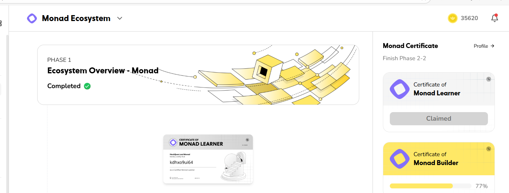

# ᝰ.ᐟ Hackquest

Tool được phát triển bởi nhóm tele Airdrop Hunter Siêu Tốc (https://t.me/airdrophuntersieutoc)

Link: [https://www.hackquest.io](https://www.hackquest.io?type=email-check&inviteCode=QZ01OYCHJN)

Full source: https://amautomarket.com/products/hack-quest-automate



## 🚨 Attention Before Running Cli Version

I am not `responsible` for the possibility of an account being `banned`!

## 📎 Node cli version Script features

- Auto quest (full 20 ecosystem & full pharse)
- Auto task
- Auto create pet and feed pet
- Auto checkin
- Auto claim reward
- Auto reff
- Auto claim certificate
- Support proxy or not
- Mutiple threads, multiple accounts

## ✎ᝰ. RUNNING

- Install Dependency

```bash
npm install
```

- Setup config in .env

```bash
nano .env
```

- Setup input value

* proxy: http://user:pass@ip:port

```bash
nano proxy.txt
```

- privatekey: how to get => join my channel: https://t.me/airdrophuntersieutoc

```bash
nano privateKeys.txt
```

- Run the script

```bash
node main.js
```
